# WBS Berichtsheft de-monkey-fier

## Installation

1. [Violentmonkey](https://violentmonkey.github.io/) Browser-Plugin installieren. [Was macht das?](#was-ist-client-side-scripting-hacke-ich-damit-unsere-server) ([Probleme mit Chrome?](#warum-funktioniert-es-auf-chrome-nicht-aka-geht-das-auch-mit-den-manifest-v2-änderungen))

2. [Den Text vom Script im Browser betrachten](https://github.com/AaronKuehne/wbs-report-portfolio-de-monkey-fier/raw/refs/heads/master/wbs-report-portfolio-de-monkey-fier.user.js), Violentmonkey erkennt ein Plugin-Script und ermöglicht die Installation.

3. Den grünen Knopf "Installieren" klicken.

    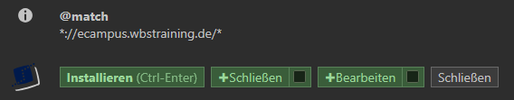

4. (optional)
    

    
Bei einer Anpassung hier im Repo, kannst Du einfach Dein Script aktuallisieren.

    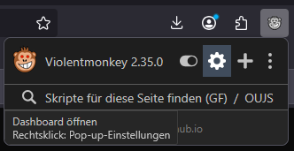

    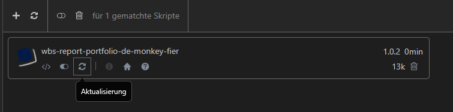

    

## Funktionen

### Berichtsheftübersicht

* **Schnellzugriff** auf das nächste Berichtsheft, auch im neuen Tab. Der zweite Klick auf *in neuem Tab öffnen* öffnet das Heft der zweiten Zeile usw.

    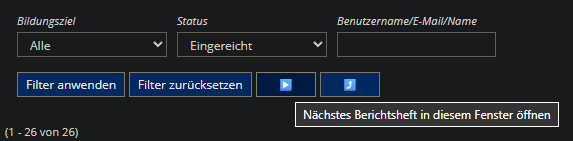
    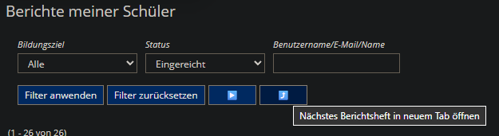

* **Autofilter**: Wenn die Übersichtsseite mit der Filterauswahl *Alle* geöffnet wird, wird automatisch *Eingereicht* ausgewählt und gefiltert. Bei anderen Filtern bekommst du einen Hinweis, damit Du nicht ausversehen alte Hefte bearbeitest.

    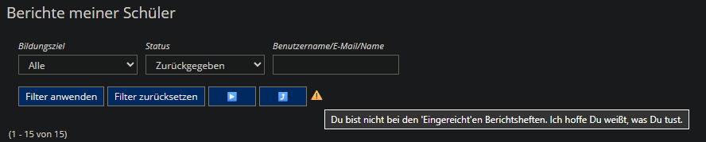

* **Deaktivierte Aktionen** im Kontextmenü um das Annehmen oder Ablehnen zu verhindern, wenn man die Berichtshefte doch nur lesen wollte.

    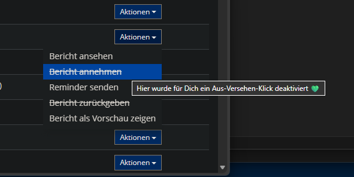

### Berichtsheft bearbeiten

* **Annehmen- und Zurückgeben-Buttons** sind jetzt besser unterscheidbar.

    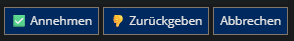

* **Schablonen für Kommentare**: unter dem Kommentarfeld findest Du jetzt vorgefertigte Schablonen. Mit einem Klick auf eine Schablone, wird diese ans Kommentar angehangen, oder aus dem Kommentar entfert, sollte sie bereits enthalten sein. (Klick -> An/Aus der Schablone). Diese Vorgang sollte manuellen Text unbeeinflusst lassen. [Die Schablonen kannst Du ganz nach eigenem Dünken anpassen.](#erweiterte-konfiguration)
Mit einem Klick auf \*Leere\* wird das Kommentarfeld schnell gesäubert.

    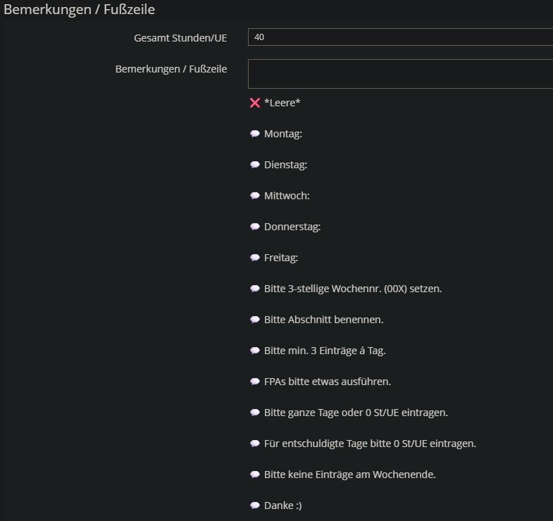

* **Schlagwortsuche**: Gefundene (auch Teil-) Wörter werden an ihrem Eintrag hervorgehoben. Groß- und Kleinschreibung wird hier ignoriert. [Die Schlagworte kannst Du anpassen.](#erweiterte-konfiguration)

    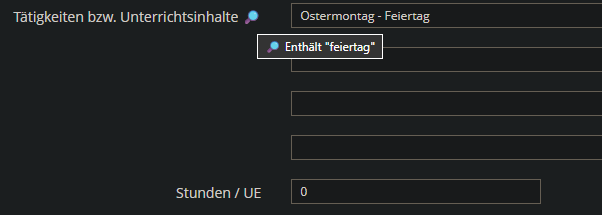

* **Validierungen**: Ein Paar Validierungen werden automatisch aufgelöst. Natürlich sind das nur Hilfestellungen. Eine Warnung heißt nicht, dass das BH wirklich ein Problem hat und keine Warnungen zeigen kein perfektes BH an.

    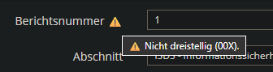

    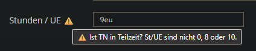

    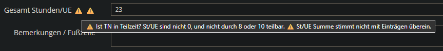

## Erweiterte Konfiguration

Am Anfang vom Script stehen zwei Konstante Listen. Einmal die Texte der Kommentar-Schablonen und einmal die Schlagwörter zum Hervorheben. Nach dem Anpassen speicherst Du das Script und bestätigst, dass Du es überschreiben möchtest.

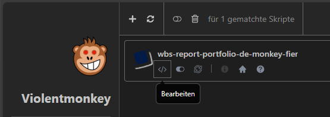
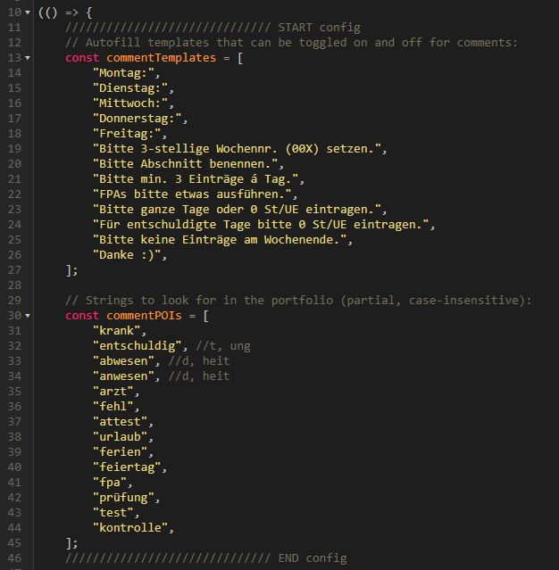

> [!WARNING]
> Wenn Du über Violentmonkey den WBS Berichtsheft de-monkey-fier aktualisiert, wird deine Konfiguration wieder überschrieben.

## FAQ

#### Was ist Client-Side-Scripting, hacke ich damit unsere Server?

Nachdem die Webseite geladen wurde, ändert das Script lokal Deine Seite in Deinem Browser. Stell es Dir wie eine Zusätzliche Ebene vor. Darunter ist immernoch die alte Seite, es passiert nichts verbotenes hier.

#### Warum funktioniert es auf Chrome nicht? (Aka. Geht das auch mit den Manifest V2 änderungen?)

Es könnte Probleme mit Chrome geben. Wähle ggf. einen anderen Browser. Statt Violentmonkey könnte [ScriptCat](https://scriptcat.org/de) funktionieren.